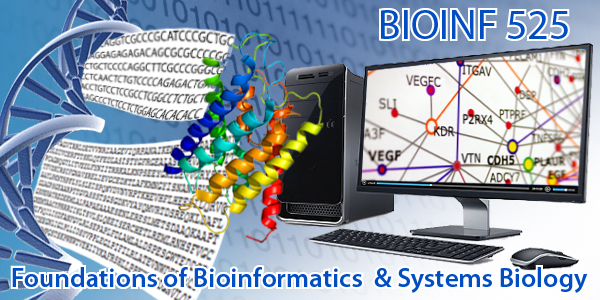

**PAGE UNDER CONSTRUCTION!!** Complete course material and a syllabus will be available soon. In the meantime, a brief course description and tentative schedule are given below.
 
 

**Description:**  BIOINF524 is a three credit three module course designed to provide biological researchers with the computational and statistical tools that they need to efficiently make use of their experimental data, and to integrate publicly available high-throughput data sets into their work. The course is intended for students with primarily experimental backgrounds and research interests, and will provide a foundation in computational and quantitative methods suitable for analysis of both low- and high-throughput data sets. 
 
 
BIOINF524 itself is comprised of modules covering: (1) Introductory programming and exploratory data analysis with R, (2) Statistical methods for biomedical data, and (3) Systems biology and analysis of high-throughput datasets. BIOINF525 allows for each one credit module to be registered for separately. Students wishing to take only the later modules should consult with the instructor before registering in order to ensure that they have appropriate background knowledge, as the material is somewhat cumulative.
 
 
The course itself consists of weekly lecture sessions and lab sessions, with the latter conducted primarily using the R programming language. Weekly homework assignments will reinforce concepts covered in lecture/lab and provide an opportunity to practice applying the methods that have been learned. 
 
 
**Schedule:**
   
  Lectures:   Tuesdays 2:30-4:00 PM, Room 2062 Palmer Commons  
  Labs:         Thursdays 2:30-4:00 PM, Room 2062 Palmer Commons  
  (Note: During Module 1, all sessions will be combined Lecture/Lab)  
 
  Module 1: January 9 - February 2 (8 combined lectures/labs)  
  Module 2: February 6 - March 15  (5 lectures, 5 labs)  
  Module 3: March 20 - April 12 (4 lectures, 4 labs)  
 
 
**Prerequisites:** A familiarity with basic biomedical concepts and basic knowledge of computer
usage. No programing skills are needed. You MUST bring your own wifi enabled laptop to
lectures and labs to fully participate in this class.
